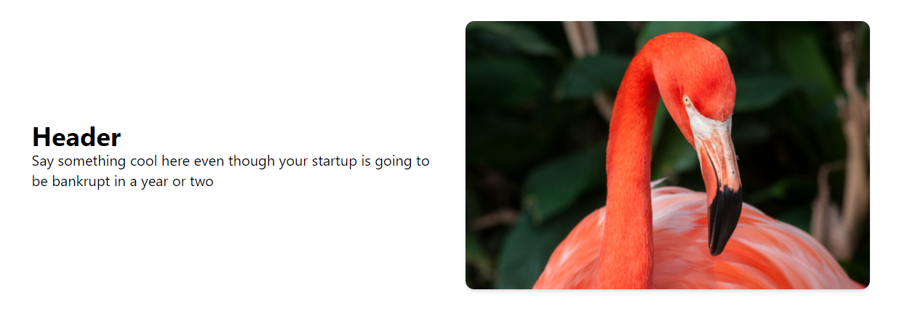
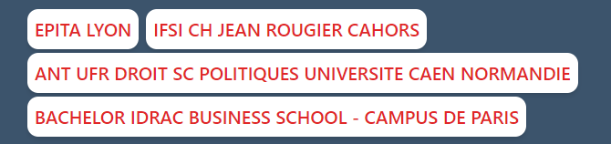

# tailwind-svelte-components
 Small component pack with basic buttons, hero, cards and chips

### Responsive Hero

### Clickable buttons with hover, and animations

### Responsive cards that work with flexbox

# Examples

### Responsive Hero used as gallery

### Chips used as a filtering system

### Responsive cards used with github api to sync repo info

